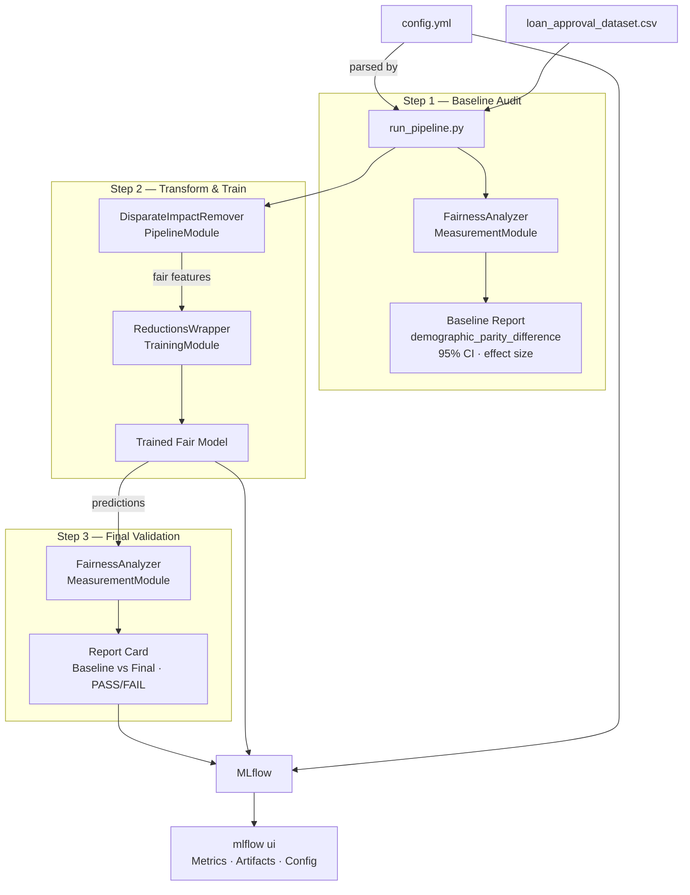

# FairML Development Toolkit — Part 5: Pipeline Orchestrator

Integrates the Measurement, Pipeline, and Training modules into a single,
declarative, end-to-end fair ML workflow controlled by one `config.yml` file.

---

## Architecture



**Data flow in plain English:**

1. `run_pipeline.py` reads `config.yml` and loads the CSV.
2. **Step 1** — `FairnessAnalyzer` audits the raw labels and prints a baseline
   fairness report (demographic parity gap + 95 % CI).
3. **Step 2** — `DisparateImpactRemover` repairs the feature distributions, then
   `ReductionsWrapper` trains a `LogisticRegression` under a `DemographicParity`
   constraint.
4. **Step 3** — `FairnessAnalyzer` re-evaluates on test-set predictions and
   prints a report card comparing the final metric to the baseline and the
   configured threshold.
5. Accuracy, fairness metrics, the trained model, and the config file are all
   logged to **MLflow** for full reproducibility.

---

## Quick Start

```bash
# 1. Install dependencies
pip install -r requirements.txt

# 2. Place your dataset in the project root (or edit data.path in config.yml)

# 3. Run the pipeline
python run_pipeline.py

# 4. Explore results
mlflow ui          # opens http://localhost:5000
```

---

## `config.yml` Reference

Every aspect of the pipeline is controlled by `config.yml`.
No code changes are needed to switch datasets, transformers, or constraints.

### `data` — dataset settings

| Key | Type | Description |
|---|---|---|
| `path` | string | Path to the input CSV file |
| `target_col` | string | Name of the ground-truth label column |
| `sensitive_col` | string | Protected attribute column (must be numeric 0/1 after preprocessing) |
| `positive_label` | int | Value representing the favourable outcome (usually `1`) |
| `drop_cols` | list[str] | Columns to discard before anything runs |

### `preprocessing` — raw transformations before the fairness step

| Key | Description |
|---|---|
| `encode[].column` | Categorical column to one-hot encode (`drop_first=True`) |
| `binning[].column` | Continuous column to discretise with `pd.cut` |
| `binning[].bins` | Bin edges (use `.inf` for unbounded upper end) |
| `binning[].labels` | String labels for each bin |
| `binning[].new_column` | Output column name |

### `transformer` — pre-processing bias mitigation (Step 2a)

Exactly **one** transformer is applied. Available classes:

| `class` | Key params |
|---|---|
| `DisparateImpactRemover` | `sensitive_col`, `repair_level` ∈ [0,1], `features_to_repair` |
| `CorrelationSuppressor` | `sensitive_col`, `threshold`, `method` |
| `InstanceReweighting` | `sensitive_col`, `target_col`, `normalise` |

### `training` — fair model training (Step 2b)

Exactly **one** training method is used. Available options:

| Key | Options |
|---|---|
| `method` | `ReductionsWrapper` |
| `base_estimator` | `LogisticRegression` |
| `constraint` | `DemographicParity` · `EqualizedOdds` · `BoundedGroupLoss` |
| `eps` | Allowed constraint-violation tolerance (default `0.01`) |
| `max_iter` | ExponentiatedGradient iterations (default `50`) |

### `validation` — final fairness gate (Step 3)

| Key | Description |
|---|---|
| `primary_metric` | Metric key returned by `FairnessAnalyzer` (e.g. `demographic_parity_difference`) |
| `threshold` | Pipeline prints **PASS** if `|metric| ≤ threshold`, **FAIL** otherwise |
| `n_bootstrap` | Bootstrap replications for confidence intervals |
| `test_size` | Fraction of data held out for evaluation (default `0.2`) |

### `mlflow` — experiment tracking

| Key | Description |
|---|---|
| `experiment_name` | MLflow experiment to log the run under |
| `run_name` | Display name for the individual run |

---

## What Gets Logged to MLflow

| Type | Key | Description |
|---|---|---|
| Metric | `accuracy` | Test-set accuracy of the fair model |
| Metric | `baseline_<primary_metric>` | Raw-data disparity before intervention |
| Metric | `final_<primary_metric>` | Model disparity after intervention |
| Metric | `final_<primary_metric>_ci_lower/upper` | Bootstrap confidence interval bounds |
| Param | `transformer` | Class name of the transformer used |
| Param | `constraint` | Fairness constraint applied during training |
| Artifact | `fair_model/` | Serialised trained model (mlflow sklearn format) |
| Artifact | `config/config.yml` | Exact config used for this run |

---

## Repository Structure

```
.
├── config.yml              ← pipeline definition (edit this)
├── run_pipeline.py         ← orchestrator (do not edit for standard runs)
├── demo.ipynb              ← end-to-end walkthrough notebook
│
├── measurement/
│   └── fairness_analyzer.py
├── pipeline/
│   └── fair_transformers.py
├── training/
│   └── reductions_wrapper.py
│
├── requirements.txt
└── README.md
```

---

## Extending the Pipeline

To add a new transformer, add one entry to the registry in `run_pipeline.py`:

```python
from pipeline.fair_transformers import YourNewTransformer

TRANSFORMER_REGISTRY = {
    ...
    "YourNewTransformer": YourNewTransformer,
}
```

Then reference it in `config.yml`:

```yaml
transformer:
  class: "YourNewTransformer"
  params:
    sensitive_col: "Gender_Male"
    your_param: value
```

No other code changes are needed.